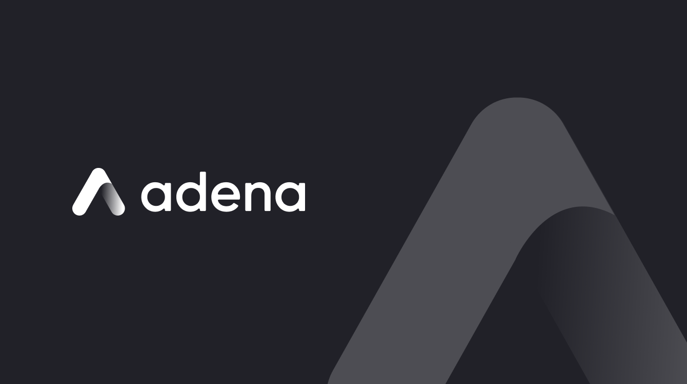

# Adena Wallet

[](https://twitter.com/adenaapp)

​

## Introduction

**Adena** is a friendly, open-source, non-custodial Gnoland wallet, built for Gnomes worldwide. Adena exists to power millions of realms (smart contracts in gnolang) and tokens that will flourish the Gnoland ecosystem with a quality interface, NFT & custom token support, and a seamless integration procedure.
​

For users, Adena makes managing crypto as simple as keeping and sending money on Paypal or Venmo.

​
For developers, Adena provides streamlined web3 experience upon integration!

​
You can find the latest official version of Adena on our [official website](https://adena.app/), or directly on [the Chrome Webstore](https://chrome.google.com/webstore/detail/adena/oefglhbffgfkcpboeackfgdagmlnihnh).

​
Also, follow us on our [Twitter](https://twitter.com/adenaapp) and [Medium](https://medium.com/@adena.app) for newest updates, patch notes, and partnership announcements!
​

## Features

✅ Create & Restore Wallet <br>
✅ View Account Balances <br>
✅ Deposit & Send Tokens <br>
✅ Transaction History <br>
✅ Settings <br>
✅ Connect to Dapps <br>
✅ Sign GNO Contracts <br>
✅ Explore Dapps <br>
✅ Multi-Accounts <br>
✅ Multi-Network <br>
✅ Ledger Support <br>
✅ Web3 Login Support <br>
⬜ Airgap Support <br>
⬜ Multi-Chain <br>
⬜ Manage Custom Tokens <br>
⬜ View & Transfer NFTs <br>
⬜ In-app Swap
​
## Building Locally

To set up a local environment, clone this repository and run the following commands:

```
 yarn install
​
 yarn build
```

​
This will store the extension's build output in `packages/adena-extension/dist`.
​

## Documentation

Check out our official documentation page for guides and brand assets.

- ️[User Guide](https://docs.adena.app/user-guide)
- [Developer Guide](https://docs.adena.app/integrations/)
- [Resources](https://docs.adena.app/resources/)
  ​
  ​

## Author

**Onbloc**

- [Website](https://onbloc.xyz)
- [Twitter](https://twitter.com/onblocxyz)
- [Medium](https://medium.com/onbloc)
  ​
  ​

## Contribution & Support

We welcome contributions from the community and are always eager to hear your ideas and feedback! If you have suggestions for improvement, want to contribute to Adena, or need support, please consider the following options:

- Read our contributing guidelines: Our [CONTRIBUTING.md](https://github.com/onbloc/adena-wallet/blob/main/CONTRIBUTING.md) file provides information on how to contribute to the project, including submitting pull requests, reporting issues, and suggesting improvements.
- Open an issue: If you encounter a bug, have a feature request, or want to suggest improvements, feel free to open an [issue](https://github.com/onbloc/adena-wallet/issues) on our GitHub repository.
- Join our community: For discussions, questions, or support, join our [channel](https://discord.com/invite/6eTSyZ3569) on Gnoland's Discord server. We're excited to collaborate and help!
